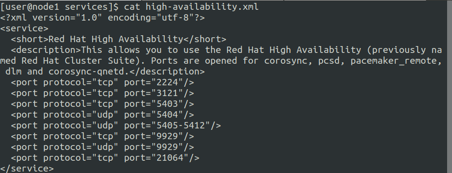

# High Availability Clustering Solution - pacemaker

# pacemaker

### Setting

HOST PC: Ubuntu 18.04

Hypervisor: qemu/kvm

Guest VMs: CentOS7

- node1
    - cpu 2 / mem 3072
    - ip 192.168.122.11
- node2
    - cpu 2 / mem 3072
    - ip 192.168.122.12
- node3
    - cpu 2 / mem 3072
    - ip 192.168.122.13

---

### Hands On

pacemaker 패키지 설치: 리소스 생성을 위한 패키지 설치와 서비스 오픈 

1. /etc/hosts 파일 편집

    /etc/hosts 각 노드별로 작성후 모든 노드에scp 로 배포

    ```bash
    $ sudo vi /etc/hosts
    	127.0.0.1   localhost localhost.localdomain localhost4 localhost4.localdomain4
    	::1         localhost localhost.localdomain localhost6 localhost6.localdomain6
    	
    	192.168.122.11 node1
    	192.168.122.12 node2
    	192.168.122.13 node3
    ```

2. Install & enable pacemaker, pcs

    ```bash
    $ sudo yum -y install pacemaker pcs
    $ sudo systemctl enable --now pcsd
    ```

3. Service Open

    ```bash
    $ sudo firewall-cmd --add-service=high-availability  --permanent
    $ sudo firewall-cmd --reload
    ```

    - 방화벽에서 서비스이름으로 등록할수 있는 서비스들 확인 경로

    ```bash
    /usr/lib/firewalld/services 에서 xml 파일로 정의 되어 있다
    xml 파일은 해당 서비스가 사용할 포트들이 정의 되어 있음,
    이 포트들을 일일히 다 열어주기 귀찮으므로 xml 파일로 만들어서 서비스
    이름으로 방화벽을 열어준다.

    2224/tcp pcs가 노드와 통신할 때 사용
    3121/tcp crmd 가 사용
    5403/tcp corosync-qnetd가 사용
    5404/udp corosync multicast udp 사용
    5405/udp corosync 사용
    21064/tcp DLM에서 사용(clvm/gfs2)
    9929/tcp,udp 다중 사이트 클러스터 구성 시 사
    ```

    

    cat /usr/lib/firewalld/services/high-availability.xml

4. hacluster id 확인

    ```bash
    $ id hacluster
    	uid=189(hacluster) gid=189(haclient) groups=189(haclient)
    $ grep hacluster /etc/passwd
    	hacluster:x:189:189:cluster user:/home/hacluster:/sbin/nologin

    * /sbin/nologin => 리눅스의 인증기능만 필요할때 사용
    ```

5. hacluster 암호 입력

    ```bash
    $ sudo echo 'dkagh1.' | passwd --stdin hacluster
    ```

6. pcs cluster 인증 ⇒ node1

    ```bash
    $ pcs cluster auth node1 node2 node3
    ```

7. pcs luster 등록 ⇒ node1

    ```bash
    $ pcs cluster setup --name cluster1 --enable node1 node2 node3
    $ pcs cluster start --all
    $ pcs cluster enable --all
    $ pcs cluster status
    ```

---

### 리소스 생성 및 활용

1. 모든 노드에서 http 설치 후 방화벽만 오픈

    아파치 리소스는 pacemaker에 의해서 관리되어야 하기 때문에 systemctl start httpd 는 하지 않음

    ```bash
    $ sudo yum -y install httpd
    $ sudo firewall-cmd --add-service=http --permanent
    $ sudo firewall-cmd --reload
    ```

2. 아파치 리소스를 생성

    필요한 리소스: ip 리소스 (⇒ fip 로 사용)

    ```bash
    - 생성 가능한 리소스 목록
    $ pcs resource list
    - pcs 리소스 필드값 확인
    $ pcs resource describe <resource name>

    - IPaddr2 리소스 생성
    $ pcs resource create webip IPaddr2 ip=192.168.122.10 cidr_netmask=24 --group=webrsc
    $ pcs resource create websvc apache --group=webrsc
    $ pcs property set stonith-enabled=false
    $ pcs status resources
    ```

3. index.html 파일생성

    ```bash
    node1 => echo "node1" > /var/www/html/index.html
    node2 => echo "node2" > /var/www/html/index.html
    node3 => echo "node3" > /var/www/html/index.html

    ```

4. 동작확인

    ```bash
    $ curl 192.168.122.10
    	node1
    ```

### 시나리오 실습

```bash
IPaddr2 리소스와 apache 리소스를 group1 이라는 이름의 리소스로 생성
해당 리소스가 배치된 노드의 high-availability 서비스를 닫음
(닫기전에 curl 192.168.122.101확인)
그리고 다른 노드에서 pcs status resources 로 리소스 위치 확인
다시 그 노드에서 high-availability  서비스를 닫음
(닫기전에 curl 192.168.122.101 확인)
쿼럼을 만족하지 못했을 때 어떻게 동작하는지 확인)
```

- 3개의 노드중 2개의 노드를 high-availability 에서 제외하면 해당 리소스의 동작은 Stopped 상태가 된다

    

- 다시 노드들을 ha에 넣고 싶으면 firewalld 에 ha 서비스 추가해주면 Stop 됐던 resource 가 다시 Started 상태가 된다

### Ansible Playbook 으로 작성

pacemaker 패키지 설치 플레이북리소스 생성을 위한 패키지 설치와 서비스 오픈 플레이북 작성
(ssh-key 기반 인증을 위해 ssh-keygen을 통한 keypair 생성 필요, 실행환경에 맞는 inventory.ini 파일, ansible.cfg 파일  점검 필요)
- pacemaker.yaml

```bash
---
- name: Deploy pacemaker
  hosts: all
  become: yes
  tasks:
    - name: Copy /etc/hosts to all nodes
      copy:
        src: hosts
        dest: /etc/hosts
    - name: Install pacemkaer
      yum:
        name: 
          - pacemaker
          - pcs
        state: present
    - name: Service start
      service:
        name: pcsd
        state: started
        enabled: yes
    - name: Service Open
      firewalld:
        service: high-availability
        permanent: yes
        state: enabled
        immediate: yes
    - name: modify hacluster user passwd
      user:
        name: hacluster
        password: "{{ 'dkagh1.' | password_hash('sha512') }}"
```

---

### Note

```bash
pacemaker는 default로 active-passive 모드 사용
active-passive 모드에서 group사용
pcs constraint == pod affinity

Cluster 내의 노드들은 corosync를 통해서 서로 연락하고
과반수 이상이 통신이 되면 클러스터를 유지
만약 과반수 되지 않는다면 클러스터를 유지하지 않음
과반수 = Quorum

3=> 2   정수( 총 노드의 수 / 2 ) + 1
4=> 3
3대 이상 홀수 권장

2=> 2 
2-node Cluster 구성

     s/w(4)  s/w(3) s/w(1)

쿼럼이란?
클러스의 노드는 몇대가 적당? 16대 이하
3대 이상 홀수 16대 이하
  => 왜 홀수가 적당한지
  => split brain

fence device
 -> fencing을 처리해주는 장치
 -> fence 기본 동작 재부팅, 종료
 -> stonith(우리는 구현 불가능)

Server <-> Power Supply(별도의 인터페이스) 
Ovirt -> Power Saving Policy

WOL(Wake On Lan)
 -> NIC에 전기적 시그널 보내서 시스템 부팅

DR = Disaster Recovery
```
